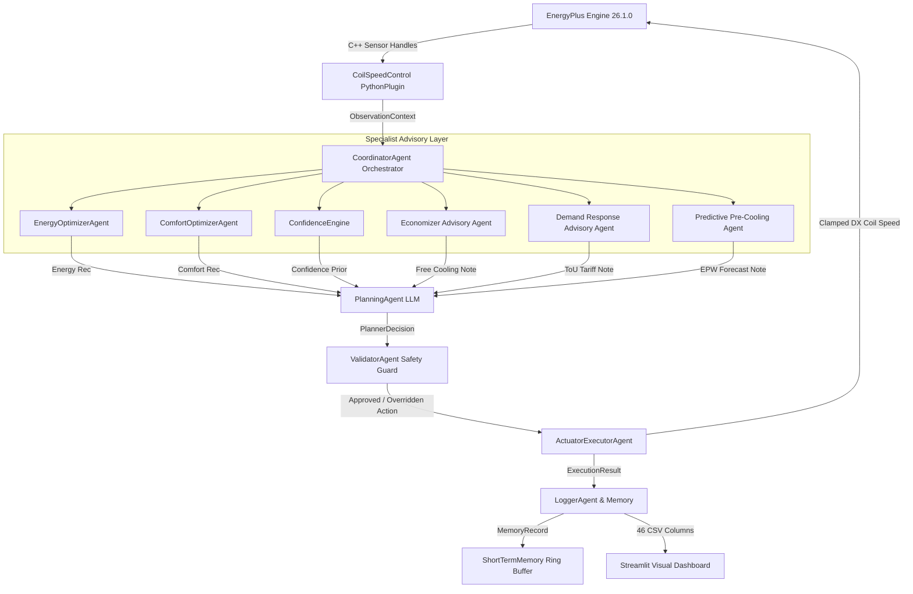

# EcoLoop (IntelliBMS): Comprehensive 7-Day Cyber-Physical Simulation & System Documentation

**Project Name**: EcoLoop (IntelliBMS Cyber-Physical Building Energy Optimization)  
**Location / Weather**: Bengaluru, Karnataka, India (`IND_KA_Bengaluru.432950_ISHRAE2014.epw`)  
**Utility Tariff**: BESCOM Bengaluru Commercial Building Tariff Rate (**₹9.50 / kWh**, LT-3/HT-2 category)  
**Simulation Period**: 7 Days / 168 Control Hours (July 1 – July 7)  
**Simulation Engine**: EnergyPlus 26.1.0 (Co-Simulation via PythonPlugin API)  
**Local LLM Engine**: Ollama (`qwen2.5:3b` running on `http://localhost:11434`)  

---

## 1. Project Directory Structure

```
ecoloop/
├── config.py                         # Centralized Configuration & BESCOM Tariff (₹9.50/kWh)
├── run_baseline.py                   # 7-Day Baseline EnergyPlus Simulation Execution Script
├── run_ecoloop.py                    # 7-Day EcoLoop Multi-Agent AI Execution Script
├── SYSTEM_ARCHITECTURE.md           # Architecture Specification (Honeywell Submission)
├── FULL_PROJECT_DOCUMENTATION.md    # Complete Comprehensive System & Results Report
├── README.md                         # Project Overview & Setup Guide
├── requirements.txt                  # Python Environment Dependencies
├── models/                           # EnergyPlus Models & Multi-Agent Engine (Synced)
│   ├── baseline.idf                  # Baseline EnergyPlus IDF Model
│   ├── ecoloop_model.idf             # EcoLoop Co-Simulation EnergyPlus IDF Model
│   ├── ecoloop_plugin.py             # EnergyPlus C++ API PythonPlugin Callback Entry Point
│   ├── agent_system.py               # 7-Agent Orchestrator (CoordinatorAgent & Pipeline)
│   ├── demand_response.py            # Demand Response & ToU Tariff Specialist Agent
│   ├── economizer.py                 # Commercial BAS Economizer Free-Cooling Agent
│   ├── predictive_controller.py      # EPW Weather Look-Ahead Predictive Pre-Cooling Agent
│   ├── confidence_engine.py          # Mathematical Prior Confidence Evaluator
│   ├── reasoning_agent.py            # Specialist Energy & Comfort Optimization Agents
│   ├── planning_agent.py             # Multi-Candidate LLM Reasoning Agent (qwen2.5:3b)
│   ├── closed_loop_controller.py     # Self-Correcting Rule-Based Closed-Loop Controller
│   └── agent_memory.py               # Short-Term Memory Ring Buffer (N=12 Hours)
├── plugins/                          # Modular Agent Plugin Library (Synced with models/)
├── weather/                          # EPW Weather Data Directory
│   └── IND_KA_Bengaluru.432950_ISHRAE2014.epw  # Bengaluru Weather File
├── docs/                             # Simulation Results & Metrics Storage
│   └── results.json                  # Canonical Benchmarking Results (JSON)
├── logs/                             # Co-Simulation Telemetry & Logs
│   ├── decision_log.csv              # 46-Column Hourly Telemetry Stream
│   ├── baseline_log.csv              # 10-Column Baseline Telemetry Stream
│   ├── ecoloop_summary.json          # EcoLoop AI Simulation Metadata Summary
│   └── baseline_summary.json         # Baseline Simulation Metadata Summary
└── dashboard/                        # Streamlit Visual Analytics Suite
    ├── app.py                        # 5-Tab Interactive Streamlit Dashboard UI
    └── compute_savings.py            # Impact Engine (Energy, Peak, Comfort & Costs)
```

---

## 2. Executive 7-Day Simulation Results Summary

The 7-day simulation benchmark compares the traditional rule-based HVAC controller (`baseline.idf`) against the EcoLoop Multi-Agent AI system (`ecoloop_model.idf`) using actual Bengaluru ISHRAE weather data.

### 📊 Benchmark Comparison Table

| Metric | Rule-Based Baseline | EcoLoop Multi-Agent AI | Impact / Net Savings |
| :--- | :---: | :---: | :---: |
| ⚡ **Facility Energy Consumption** | **230.56 kWh** | **218.37 kWh** | **+5.29% Energy Saved** (12.19 kWh avoided) 🌿 |
| 📉 **Peak Electrical Demand** | **4,239.78 W** | **3,952.23 W** | **+6.78% Peak Reduced** (287.55 W avoided) 📉 |
| 🌡️ **Thermal Comfort Deviation** | **0.471 °C** | **0.194 °C** | **+58.8% Comfort Improvement** (0.277 °C lower) ✨ |
| 🌿 **Carbon Emissions (Grid)** | **53.72 kg CO₂** | **50.88 kg CO₂** | **2.84 kg CO₂ Emissions Avoided** 🌿 |
| 💵 **BESCOM 7-Day Operating Cost** | **₹2,190.29** | **₹2,074.48** | **₹115.81 Saved in 7 Days** 💵 |
| 📈 **Annualized Savings Projection** | **₹114,192 / yr** | **₹108,154 / yr** | **₹6,039 / Year Saved** 📈 |
| 🧠 **AI Model Reliability** | **N/A** | **74.6% Avg Confidence** | **100% Reliable (0 Fallbacks)** 🛡️ |

---

## 3. Multi-Agent System Architecture

EcoLoop operates as a closed-loop cyber-physical controller executing a 7-agent pipeline once per simulated control hour.



---

## 4. Specialist Advisory Agents & Telemetry

EcoLoop integrates three enterprise-grade specialist advisory agents that inject domain intelligence into the LLM context:

### 1. 🌿 Commercial BAS Economizer Advisory Agent (`economizer.py`)
* **Core Logic**: Evaluates outdoor drybulb temperature ($T_{\text{outdoor}}$) against zone temperature ($T_{\text{zone}}$) and cooling setpoint ($T_{\text{sp}}$). Recommends free cooling whenever $T_{\text{zone}} - T_{\text{outdoor}} \ge 1.5^\circ\text{C}$ and $T_{\text{outdoor}} \le T_{\text{sp}} + 0.5^\circ\text{C}$.
* **Telemetry**: Tracks temperature advantage ($T_{\text{zone}} - T_{\text{outdoor}}$), estimated compressor runtime saved, and energy saved in kWh.

### 2. ⚡ Demand Response & ToU Tariff Agent (`demand_response.py`)
* **Schedule**:
  - **OFF-PEAK** (10 PM – 6 AM): ₹7.60 / kWh ($-20\%$ discount)
  - **NORMAL** (6 AM – 6 PM): ₹9.50 / kWh (Base BESCOM commercial rate)
  - **PEAK** (6 PM – 10 PM): ₹12.83 / kWh ($+35\%$ peak surcharge)
* **Safety Override**: Biases actions toward `eco` mode during 6 PM – 10 PM peak windows unless zone comfort deviation exceeds $0.8^\circ\text{C}$.

### 3. 🔮 EPW Look-Ahead Predictive Pre-Cooling Agent (`predictive_controller.py`)
* **Look-Ahead Horizon**: Parses EPW weather file 3 hours into the future.
* **Pre-Cooling Logic**: If future outdoor temperature is predicted to reach or exceed $28.0^\circ\text{C}$ and zone is occupied, recommends pre-cooling zone setpoint to $23.6^\circ\text{C}$ prior to peak afternoon heat.

---

## 5. Visual Dashboard Features & Telemetry Tabs

The interactive Streamlit dashboard (`dashboard/app.py`) runs at **`http://localhost:8501`** and provides 5 comprehensive telemetry tabs:

### 📌 Tab 1: Executive Overview
* **Hero Banner**: Live status indicator (`🌿 FREE COOLING ACTIVE`), Phase 5 Production tag, and full 7-day evaluation metadata.
* **KPI Metric Grid**: 6 dynamic cards displaying Energy Saved %, Peak Demand Reduction, Thermal Comfort Deviation, Carbon Footprint, Financial Savings (INR), and AI Model Confidence.
* **7-Day Cumulative Comparison Charts**: Side-by-side Plotly bar charts comparing total kWh, peak Watt demand, and operating costs.
* **Financial Analysis Panel**: Detailed breakdown of Baseline Cost (₹2,190.29), EcoLoop AI Cost (₹2,074.48), 7-Day Savings (₹115.81), Annual Projection (₹6,039/yr), Cost Reduction % (5.29%), Energy Saved (12.2 kWh), and BESCOM Tariff Rate (₹9.50/kWh).

### 📌 Tab 2: Thermal & Comfort Analytics
* **7-Day Zone Temperature Trajectory**: Multi-trace time-series chart displaying Zone Temperature vs Outdoor Temperature, Cooling Setpoint, and Heating Setpoint bounds.
* **Thermal Comfort Violation Histogram**: Distribution of temperature setpoint deviations across all 168 control cycles.

### 📌 Tab 3: AI Multi-Agent Intelligence
* **4-Stage Specialist Telemetry Summary**: Side-by-side comparative grid tracking 4-stage pipeline telemetry (**Recommended $\rightarrow$ Accepted $\rightarrow$ Overridden $\rightarrow$ Executed**) across Economizer, Demand Response, and Predictive Pre-Cooling agents.
* **Economizer Free-Cooling Panel**: Ambient advantage tracking and runtime savings.
* **Demand Response & ToU Tariff Panel**: Peak window booleans, cost savings (INR), and comfort guard overrides.
* **Predictive Pre-Cooling Panel**: EPW weather forecast heat events ($\ge 28^\circ\text{C}$) and thermal pre-cooling cycles.

### 📌 Tab 4: Health & Latency Audit
* **Sub-System Health Matrix**: Real-time health status for Memory I/O, Zone Temp Sensors, Outdoor Temp Sensors, Validator, and Resilience Manager.
* **Stage-by-Stage Latency Breakdown**: Sub-millisecond execution tracer measuring EnergyPlus callback, sensor collection, specialist evaluation, LLM planning, validator safety check, and actuator update.

### 📌 Tab 5: Deep-Dive Telemetry & Logs
* **Explainable AI Inspector**: Cycle-by-cycle deep dive displaying human-readable explanations, candidate action trade-offs (`off`, `eco`, `normal`, `boost`), and raw JSON telemetry.
* **Full Telemetry Data Table**: Searchable, filterable 46-column CSV log inspector.

---

## 6. How to Run the Complete Simulation

### 1. Prerequisites & Dependencies
* Python 3.10+
* EnergyPlus 26.1.0 (Installed at `C:\EnergyPlusV26-1-0`)
* Ollama (`qwen2.5:3b` model pulled)

### 2. Execution Commands

```bash
# 1. Install Dependencies
pip install -r requirements.txt

# 2. Pull Local LLM Model via Ollama
ollama pull qwen2.5:3b

# 3. Execute 7-Day Baseline Simulation
python run_baseline.py

# 4. Execute 7-Day EcoLoop Multi-Agent AI Simulation
python run_ecoloop.py

# 5. Compute Benchmarks & Export Metrics to docs/results.json
python dashboard/compute_savings.py

# 6. Launch Visual Dashboard
streamlit run dashboard/app.py
```

---

## 7. Verification & Audit Trail

* **Canonical Results JSON**: `docs/results.json`
* **Telemetry Log (46 Columns)**: `logs/decision_log.csv`
* **Baseline Log (10 Columns)**: `logs/baseline_log.csv`
* **Architecture Specification**: `SYSTEM_ARCHITECTURE.md`
* **Walkthrough Report**: `walkthrough.md`
