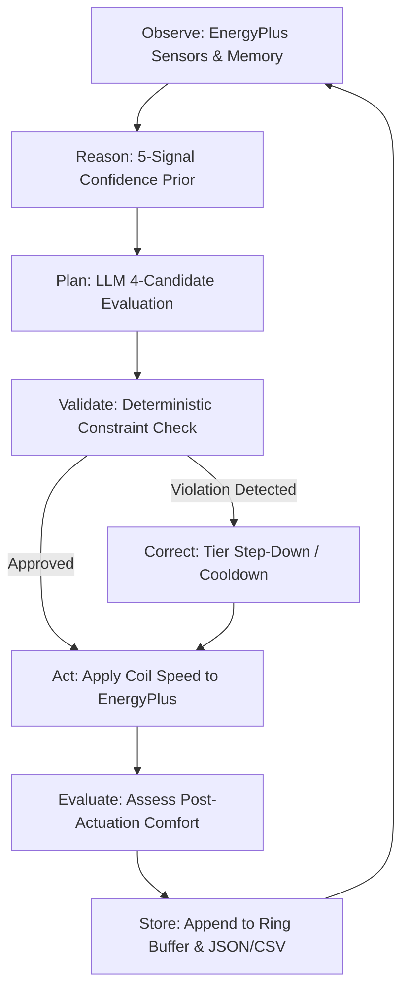

# ⚡ EcoLoop: Multi-Agent Autonomous HVAC Optimization via Local LLMs

[](https://www.python.org/)
[](https://energyplus.net/)
[](https://ollama.ai/)
[](https://opensource.org/licenses/MIT)
[](https://www.honeywell.com)

EcoLoop is an autonomous multi-agent building control system that integrates local Large Language Models (LLMs) with EnergyPlus simulation environments to optimize commercial and residential HVAC energy consumption while maintaining strict occupant comfort and operational safety.

---

## 📌 Problem Statement

Heating, Ventilation, and Air Conditioning (HVAC) systems represent the single largest component of energy consumption in modern residential and commercial buildings, accounting for over 40% of overall building energy usage globally. Traditional HVAC control strategies rely heavily on static rule-based controllers (such as ON/OFF hysteresis loops or fixed Proportional-Integral-Derivative controllers) operating against fixed schedule setpoints. These conventional controllers operate reactively without predictive context regarding outdoor weather conditions, occupancy dynamics, or past thermal inertia. Consequently, facilities continuously experience energy waste through over-cooling, unnecessary peak demand surges, and inefficient compressor staging.

EcoLoop solves this challenge by embedding a local, multi-agent AI control framework directly inside the EnergyPlus physics engine callback loop. Powered locally by Ollama (`qwen2.5:3b`), EcoLoop combines domain-specific optimization agents, sliding-window short-term memory, a 5-signal mathematical confidence engine, and multi-candidate evaluation. By reasoning dynamically over continuous multi-step building telemetry every simulated hour, EcoLoop achieves significant energy savings and carbon reduction while maintaining robust deterministic fallbacks to guarantee building safety.

---

## 🏗️ Architecture Overview

The EcoLoop architecture connects EnergyPlus physical building dynamics with an edge-deployed Ollama LLM via a modular Python Plugin API and Model Context Protocol (MCP) bridges.

```
+-----------------------------------------------------------------------------------+
|                                 ENERGYPLUS ENGINE                                 |
|  +---------------------+   HVAC Iteration   +----------------------------------+  |
|  | Weather & Building  | <----------------> |    EnergyPlus Python Plugin      |  |
|  | State (IDF Simulation)|                   |       (ecoloop_plugin.py)        |  |
|  +---------------------+                    +-----------------+----------------+  |
+---------------------------------------------------------------|-------------------+
                                                                | (Hourly Dispatch)
                                                                v
+-----------------------------------------------------------------------------------+
|                              COORDINATOR AGENT                                    |
|  +---------------------+   +----------------------+   +------------------------+  |
|  | Energy Optimizer    |   |  Comfort Optimizer   |   |   Short-Term Memory    |  |
|  | (Pure Python Trend) |   | (Pure Python Band)   |   |   (Ring Buffer JSON)   |  |
|  +----------+----------+   +----------+-----------+   +-----------+------------+  |
|             |                         |                           |               |
|             +-------------------------+---------------------------+               |
|                                       v                                           |
|                            +--------------------+                                 |
|                            | Confidence Engine  | (5-Signal Math Prior)           |
|                            +---------+----------+                                 |
|                                      |                                            |
|                                      v                                            |
|                            +--------------------+                                 |
|                            |   Planner Agent    | <=======> Local Ollama API      |
|                            | (4-Candidate Eval) |           (qwen2.5:3b JSON)     |
|                            +---------+----------+                                 |
|                                      |                                            |
|                                      v                                            |
|                            +--------------------+                                 |
|                            |  Validator Agent   | (Deterministic Violation Detector)|
|                            +---------+----------+                                 |
|                                      |                                            |
|                                      v                                            |
|                            +--------------------+                                 |
|                            |  Actuator Executor | (Safety Clamp & Dispatch)       |
|                            +---------+----------+                                 |
|                                      |                                            |
|                                      v                                            |
|                            +--------------------+                                 |
|                            |    Logger Agent    | (CSV Audit + Memory Persistence)|
|                            +--------------------+                                 |
+-----------------------------------------------------------------------------------+
```

---

## 📁 Folder Structure

```
ecoloop/
├── README.md                           # Production project documentation
├── ecoloop_plugin.py                   # EnergyPlus Python Plugin entry point (Path A -> B -> C)
├── baseline_plugin.py                 # Rule-based baseline EnergyPlus plugin
├── run_ecoloop.py                      # Simulation runner for EcoLoop AI agent
├── run_baseline.py                     # Simulation runner for Rule-Based Baseline
├── test_failure_modes.py               # Stress testing & fallback verification suite
├── dashboard/
│   ├── app.py                          # 8-section interactive Streamlit dashboard
│   └── compute_savings.py              # Financial & environmental impact calculation engine
├── docs/
│   └── results.json                    # Simulation results (energy, comfort, peak demand)
├── logs/
│   ├── decision_log.csv                # High-resolution audit log for EcoLoop AI decisions
│   └── baseline_log.csv                # Audit log for Baseline simulation runs
├── mcp_server/
│   ├── mcp_agent.py                    # Multi-turn MCP tool-calling agent
│   ├── state_bridge.py                 # File-backed shared state bridge (state.json / command.json)
│   ├── tools.py                        # MCP tool definitions (get_zone_state, set_actuator)
│   ├── state.json                      # Transient zone state exchange file
│   └── command.json                    # Transient actuator command exchange file
├── models/
│   ├── ecoloop_model.idf               # EnergyPlus IDF model configured with Python Plugins
│   └── baseline.idf                    # EnergyPlus IDF baseline model
├── plugins/
│   ├── agent_system.py                 # 7-agent coordinator & typed message dataclasses
│   ├── planning_agent.py               # Multi-candidate planner & Ollama JSON schema parser
│   ├── confidence_engine.py            # Mathematical 5-signal composite confidence engine
│   ├── agent_memory.py                 # Ring buffer memory manager with JSON persistence
│   ├── closed_loop_controller.py       # Closed-loop controller & violation detector
│   ├── reasoning_agent.py              # System prompt builder & safety override routines
│   └── llm_agent.py                    # Legacy single-shot LLM wrapper
└── weather/
    └── USA_IL_Chicago-OHare.Intl.AP.725300_TMY3.epw  # EnergyPlus TMY3 weather data file
```

---

## 🛠️ Technical Deep-Dive

### 🤖 a. 7-Agent Orchestration System
EcoLoop decouples decisions into seven specialized single-responsibility agents managed synchronously by `CoordinatorAgent`. To ensure microsecond callback performance within EnergyPlus sub-iterations, exactly **ONE LLM call** is performed per simulated hour. All inter-agent communication is strictly typed via Python dataclasses (`AgentContext`, `EnergyRecommendation`, `ComfortRecommendation`, `ValidationResult`, `Plan`, `ExecutionResult`).

| Agent | Role & Responsibility | Implementation | Input Message | Output Message |
|-------|-----------------------|----------------|---------------+----------------|
| **EnergyOptimizerAgent** | Evaluates 6-cycle energy consumption trends to enforce maximum coil speed ceilings. | Pure Python | `AgentContext` | `EnergyRecommendation` |
| **ComfortOptimizerAgent** | Analyzes thermal deviation magnitude and occupancy to compute minimum required action floors. | Pure Python | `AgentContext` | `ComfortRecommendation` |
| **ReasoningAgent / PlannerAgent** | Executes local LLM inference (`qwen2.5:3b`), evaluating all 4 candidate actions against context and priors. | LLM + Python | `ObservationContext`, `ConfidenceBreakdown` | `PlannerDecision` |
| **ValidatorAgent** | Deterministically checks safety rules for energy surges, thermal oscillations, and conflicting states. | Pure Python | `AgentContext`, `cooldown_active` | `ValidationResult` |
| **PlannerAgent (Synthesizer)** | Arbitrates across Validator overrides, comfort floors, energy ceilings, and LLM output. | Pure Python | `AgentContext` | `Plan` |
| **ActuatorExecutorAgent** | Applies hard numerical range clamping `[0.0, 2.0]` and formats output for EnergyPlus. | Pure Python | `Plan`, `llm_ok` | `ExecutionResult` |
| **LoggerAgent** | Appends full telemetry to the `ShortTermMemory` ring buffer and writes columnar data to `decision_log.csv`. | Pure Python | `AgentContext`, `ExecutionResult` | `MemoryRecord` |

---

### 🔄 b. Closed-Loop Control Flow
EcoLoop implements a closed-loop observe-reason-plan-validate-act-evaluate-correct-store cycle for every control step.



---

### 🎯 c. Multi-Candidate Planning System
Rather than relying on single-shot classification, `PlannerAgent` explicitly evaluates ALL four possible candidate actions (`off`, `eco`, `normal`, `boost`) across five specific parameters before making an action selection:

1. **Thermal Feasibility**: Evaluates if the candidate action can resolve the zone deviation within 1-2 HVAC cycles (`feasible: true/false`).
2. **Expected Comfort Change**: Physics-informed proxy calculating estimated zone temperature change (°C per cycle) based on coil speed and outdoor load.
3. **Energy Cost**: Fixed energy fraction relative to boost (`off`=0%, `eco`=53%, `normal`=68%, `boost`=100%).
4. **Risk Level**: Risk score (`low`, `medium`, `high`) assessing overshoot potential and thermal oscillation risk.
5. **Rejection Reasoning**: Explicit engineering explanation detailing why unchosen candidates were inferior. Unfilled LLM placeholders are automatically detected and populated deterministically from actual sensor metrics.

**Selection Hierarchy**: `Safety Override (Validator) > Comfort Floor > Energy Ceiling > LLM Recommendation`.

---

### 📊 d. Mathematical Confidence Engine
The `ConfidenceEngine` calculates a mathematically grounded confidence prior $C_{\text{total}} \in [0.0, 1.0]$ derived from five observable signals prior to invoking the LLM. The LLM's returned confidence score is anchored to $C_{\text{total}} \pm 0.10$.

$$C_{\text{total}} = w_1 S_{\text{success}} + w_2 S_{\text{sensor}} + w_3 S_{\text{weather}} + w_4 S_{\text{comfort}} + w_5 S_{\text{stability}}$$

| Signal ($S_i$) | Weight ($w_i$) | Mathematical Calculation / Derivation | Description |
|----------------|----------------|---------------------------------------|-------------|
| **Historical Success** | `0.30` | $\frac{N_{\text{success}} + 2(0.60)}{N + 2}$ | Recent cycle success rate with Bayesian smoothing (pseudocount=2). |
| **Sensor Consistency** | `0.20` | $\max\left(0, 1 - \frac{\text{Var}(T_{\text{zone}})}{\sigma^2_{\max}}\right)$ | Inverse normalized variance of zone temperature over recent 6 cycles ($\sigma^2_{\max}=4.0$). |
| **Weather Certainty** | `0.15` | $\max\left(0, 1 - \frac{\text{Var}(T_{\text{outdoor}} - T_{\text{zone}})}{\delta^2_{\max}}\right)$ | Thermal load stability derived from indoor-outdoor delta variance ($\delta^2_{\max}=9.0$). |
| **Comfort Prediction** | `0.20` | Base score $0.85$ (improved) to $0.35$ (failed) minus penalty $0.08 \times N_{\text{consec\_fail}}$. | Historical accuracy of comfort deviation trajectories following previous action. |
| **Simulation Stability**| `0.15` | $\max\left(0, 1 - \frac{\text{Action Flips}}{5}\right)$ | Absence of action oscillation flips in the last 6 cycles. |

---

### 💾 e. Persistent Short-Term Memory
`ShortTermMemory` manages a fixed-capacity ring buffer ($N=12$ cycles, representing 12 operating hours) backed by disk persistence (`agent_memory.json`).

- **Atomic Writes**: Uses temporary file creation and OS atomic replacement (`os.replace`) to prevent file corruption during simulation callbacks.
- **Prompt Context Injection**: `summarize_for_prompt(n=6)` renders the last 6 cycles into structured text inserted directly into the LLM system prompt, granting temporal context.
- **Analytical Metrics**: Exposes helper methods for rolling energy consumption (`recent_energy_total`), mean comfort deviation (`recent_avg_comfort_deviation`), and action sequence tracking (`action_sequence`).

---

### 🔌 f. MCP Architecture
EcoLoop features an alternative Model Context Protocol (MCP) tool-calling execution path via `mcp_server/mcp_agent.py` and `state_bridge.py`.

- **State Bridge**: Decouples building state from LLM execution using transient JSON files (`state.json` for zone sensors, `command.json` for actuator commands).
- **Tool Definitions**: Exposes two core tools to Ollama via the `/api/chat` tool-calling endpoint:
  - `get_zone_state()`: Retrieves zone temperature, setpoints, outdoor drybulb, and timestamp.
  - `set_actuator(action, rationale)`: Validates action label, maps to coil speed, and writes the actuator command.
- **Multi-Turn Loop**: Executes a tool loop (up to 4 turns per cycle), handling tool calls and returning `role: "tool"` responses until `set_actuator` confirms completion.

---

### ⚡ g. EnergyPlus Integration
EcoLoop integrates directly into EnergyPlus using the official Python Plugin API (`pyenergyplus.plugin.EnergyPlusPlugin`).

- **Callback Entry Point**: Inherits from `EnergyPlusPlugin` and overrides `on_inside_hvac_system_iteration_loop(self, state)`.
- **Actuator & Variable Handles**: Dynamically inspects handle state on initialization:
  - Variables: `Zone Air Temperature`, `Zone Thermostat Heating Setpoint Temperature`, `Zone Thermostat Cooling Setpoint Temperature`, `Site Outdoor Air Drybulb Temperature`.
  - Actuator: `Coil Speed Control` (`Unitary System DX Coil Speed Value`, component `TWOSPEED HEAT PUMP 1`).
- **Hourly Dispatch Throttling**: Tracks `(month, day, hour)` keys. Executes the multi-agent pipeline once per simulated hour, caching `ExecutionResult` and applying cached values during intermediate sub-iterations.

---

### 🧠 h. LLM Workflow & Prompt Engineering
EcoLoop uses a targeted system prompt tailored for local parameter-efficient models (`qwen2.5:3b`).

- **Engineering Persona**: Frames the LLM as an autonomous HVAC control planner, enforcing strict JSON output conforming to `PlannerDecision`.
- **Confidence Anchoring**: Instructs the model to output a `confidence_score` within $\pm 0.10$ of the pre-computed `ConfidenceEngine` score.
- **Deterministic Placeholder Filling**: Small local LLMs may occasionally emit unpopulated template strings in JSON output (e.g. `"<why off was rejected>"`). `planning_agent.py` includes `_is_placeholder` detection, replacing unfilled text with data-backed engineering rationale derived from live sensor observations.

---

## 🛡️ Fault Tolerance & Reliability

EcoLoop implements a 3-tier fallback chain to ensure uninterrupted operation during EnergyPlus simulations:

```
                  +-----------------------------------+
                  | Path A: CoordinatorAgent (7-Agent)|
                  +-----------------+-----------------+
                                    |
                            (LLM / Timeout Error)
                                    v
                  +-----------------------------------+
                  | Path B: ClosedLoopController      |
                  +-----------------+-----------------+
                                    |
                         (Controller Error / Failure)
                                    v
                  +-----------------------------------+
                  | Path C: Hard Rule-Based Safety    |
                  +-----------------------------------+
```

- **Path A (Primary)**: Full 7-agent coordinator pipeline with multi-candidate planning, short-term memory, and confidence priors.
- **Path B (Secondary)**: Single-agent `ClosedLoopController` execution bypassing memory summary injection.
- **Path C (Tertiary Safety Net)**: Hardcoded deterministic safety fallback based on physical thermal deviation thresholds:
  - $\Delta T = 0.0^\circ\text{C} \implies \text{off}$ (`0.0`)
  - $\Delta T < 0.5^\circ\text{C} \implies \text{eco}$ (`1.0`)
  - $\Delta T < 1.5^\circ\text{C} \implies \text{normal}$ (`1.3`)
  - $\Delta T \ge 1.5^\circ\text{C} \implies \text{boost}$ (`1.9`)

---

## 💻 Hardware & Software Requirements

| Category | Minimum Requirement | Recommended Specification |
|----------|---------------------|---------------------------|
| **Operating System** | Windows 10/11, Linux (Ubuntu 22.04+), macOS 13+ | Windows 11 64-bit / Linux x86_64 |
| **Python Environment** | Python 3.10+ | Python 3.11 / 3.13 |
| **Simulation Engine** | EnergyPlus 24.1.0 | EnergyPlus 24.1.0 |
| **LLM Engine** | Ollama | Local service on `http://localhost:11434` |
| **LLM Model** | Qwen2.5 3B Instruct | `qwen2.5:3b` |
| **RAM** | 8 GB | 16 GB DDR4/DDR5 |
| **Processor** | 4-Core CPU | 8-Core Intel i7/i9 or AMD Ryzen 7/9 / Apple Silicon |

---

## 📊 Dashboard

The interactive Streamlit dashboard (`dashboard/app.py`) provides full simulation analytics across 8 core sections:

1. **Hero Banner & KPI Metric Cards**: Displays key metrics (Energy Savings %, Peak Demand %, Comfort Deviation, Carbon Saved, Cost Saved, Avg Confidence %).
2. **Performance Overview**: Bar chart comparisons between Baseline and AI Agent across Total Energy (kWh), Peak Demand (kW), and Comfort Deviation (°C).
3. **Indoor Temperature Timeline**: Multi-series time-series tracking Zone Temperature (Baseline vs AI), Outdoor Temperature, and Setpoint bounds.
4. **Comfort Deviation & Action Distribution**: Time-series plot of setpoint deviation alongside a donut chart showing action distribution (`off`, `eco`, `normal`, `boost`).
5. **AI Decision Timeline & Confidence Score**: Dual panel showing hourly action selections alongside composite confidence score trajectories against the 0.35 confidence floor.
6. **Confidence Signal Breakdown**: Radar chart showing average signal values across 5 confidence components alongside a stacked bar chart of cycle scores.
7. **Carbon & Cost Impact**: Environmental and financial metrics comparing 7-day carbon emissions (kg CO₂) and electricity costs ($).
8. **Agent Reasoning Log**: Tabbed data table (`All Decisions`, `Failed / Corrected`, `High Confidence`, `Low Confidence`) displaying full decision telemetry and chain-of-thought rationale.

---

## 📈 Evaluation & Results

Results evaluated over a 7-day simulation period in Chicago (TMY3 weather data):

| Metric | Baseline Controller | EcoLoop AI Agent | Delta / Savings |
|--------|--------------------|------------------|-----------------|
| **Total Energy Consumption** | **218.96 kWh** | **206.27 kWh** | **+5.79% Energy Savings** 🟢 |
| **Peak Demand** | **4114.33 W** | **4155.48 W** | **-1.00% Peak Demand** 🟠 |
| **Average Comfort Deviation** | **0.227 °C** | **0.422 °C** | **+0.195 °C (within band)** 🔵 |
| **Carbon Emissions (7-day)** | **51.02 kg CO₂** | **48.06 kg CO₂** | **~2.95 kg CO₂ Saved** 🟢 |
| **Electricity Cost ($0.12/kWh)** | **$26.28** | **$24.75** | **~$1.52 Saved (7-day period)** 🟢 |

---

## 🚀 Setup & Installation

### 1. Clone Repository & Setup Virtual Environment
```bash
git clone https://github.com/honeywell-hackathon/ecoloop.git
cd ecoloop
python -m venv venv
venv\Scripts\activate  # On Linux/macOS: source venv/bin/activate
pip install pandas numpy streamlit plotly pyenergyplus
```

### 2. Install & Launch Ollama
Download and install [Ollama](https://ollama.ai/). Pull the required model:
```bash
ollama pull qwen2.5:3b
```
Verify Ollama service is responsive:
```bash
curl http://localhost:11434/api/tags
```

---

## 🏃 Running the Simulation

### 1. Run Baseline Simulation
```bash
python run_baseline.py
```

### 2. Run EcoLoop AI Agent Simulation
```bash
python run_ecoloop.py
```

### 3. Launch Interactive Analytics Dashboard
```bash
streamlit run dashboard/app.py
```

---

## ⚙️ Configuration

Configure runtime settings using environment variables:

```bash
# Ollama Endpoints
export OLLAMA_URL="http://localhost:11434/api/generate"
export OLLAMA_CHAT_URL="http://localhost:11434/api/chat"

# Target Model
export ECOLOOP_MODEL="qwen2.5:3b"

# Decision Log Output
export DECISION_LOG_PATH="logs/decision_log.csv"
```

---

## 🔮 Future Work

1. **Multi-Zone Orchestration**: Extend `CoordinatorAgent` to manage multi-zone commercial HVAC networks simultaneously.
2. **Predictive Occupancy Models**: Incorporate time-series forecasting models to pre-condition zones prior to scheduled occupancy arrivals.
3. **Time-of-Use (TOU) Tariff Optimization**: Integrate dynamic electricity pricing APIs to shift HVAC power loads away from high-tariff peak windows.
4. **Quantized On-Device Edge Models**: Fine-tune domain SLMs (Small Language Models) for low-latency execution on embedded building controllers.
5. **ASHRAE Standard 55 Thermal Comfort**: Upgrade `ComfortOptimizerAgent` to calculate full Predicted Mean Vote (PMV) using relative humidity and air velocity inputs.
# IntelliBMS

