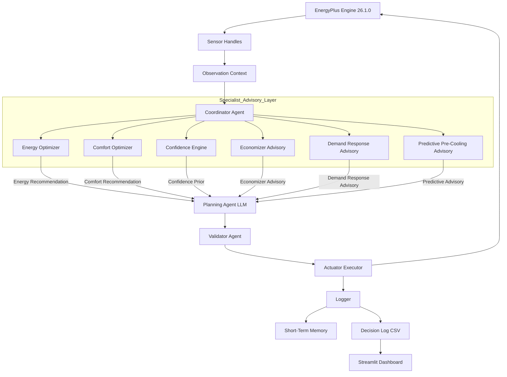
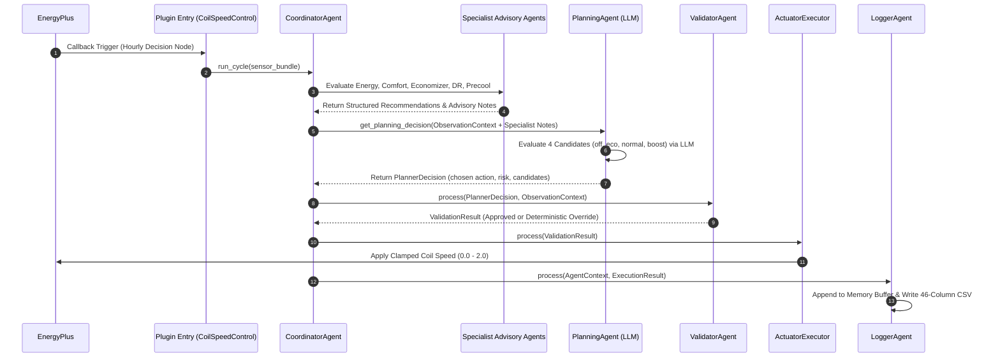

# SYSTEM_ARCHITECTURE.md :-EcoLoop Multi-Agent HVAC Control Architecture

**Author**: Senior Software Architect, BMS & Autonomous Systems  
**Project**: EcoLoop (IntelliBMS Cyber-Physical Energy Optimisation System)  
**Target Environment**: Commercial Building Automation Systems (BAS), EnergyPlus 26.1.0, Local Ollama (`qwen2.5:3b`)

---

## 1. Project Overview

### Problem Statement & Motivation
Commercial HVAC systems account for over 40% of total electrical energy consumption in modern commercial buildings. Traditional Building Management Systems (BMS) rely on rigid, rule-based Proportional-Integral-Derivative (PID) feedback loops and static Time-of-Day schedules. While PID loops maintain setpoint stability under nominal conditions, they lack predictive intelligence, weather look-ahead capacity, awareness of dynamic Time-of-Use (ToU) utility pricing, and outdoor air economizer opportunity detection. Consequently, commercial HVAC equipment frequently operates at excessive compressor coil speeds during peak tariff hours, wastes free cooling opportunities during mild ambient conditions, and reacts to thermal drift only after comfort violations occur.

### Technical Objective
EcoLoop addresses these limitations by introducing a closed-loop, multi-agent cyber-physical control architecture integrated directly into EnergyPlus co-simulations via Python Plugins. The system orchestrates stateless Specialist Advisory Agents, a mathematical Confidence Engine, an LLM-based Planning Agent, and a deterministic Safety Validator. The objective is to minimize facility electrical consumption and peak demand loads while maintaining occupant thermal comfort within strict safety envelopes.

---


## 2. System Architecture

EcoLoop follows a modular, 7-agent hierarchical pipeline executed synchronously once per simulated control hour.

### System Architecture Diagram



### Component Responsibilities

* **EnergyPlus Engine 26.1.0**: Simulates building thermal dynamics, zone air heat balances, outdoor weather, and variable-speed DX cooling coil performance.
* **CoilSpeedControl (`ecoloop_plugin.py`)**: EnergyPlus PythonPlugin entry point. Intercepts runtime callbacks (`on_inside_hvac_system_iteration_loop`), acquires C++ API sensor handles, and throttles decision execution to hourly nodes.
* **CoordinatorAgent (`agent_system.py`)**: Top-level orchestrator. Owns system state, short-term memory, performance tracing, and executes the multi-agent pipeline sequentially per control step.
* **EnergyOptimizerAgent (`reasoning_agent.py`)**: Specialist agent calculating energy-conserving coil speed actions based on setpoint deviation and historical consumption.
* **ComfortOptimizerAgent (`reasoning_agent.py`)**: Specialist agent evaluating occupant comfort bounds (Fanger PMV / deviation) and generating rapid pull-down action recommendations.
* **ConfidenceEngine (`confidence_engine.py`)**: Multi-factor mathematical evaluator that computes real-time decision confidence across historical success, sensor consistency, weather stability, and comfort predictability.
* **Economizer Advisory Agent (`economizer.py`)**: Commercial BAS module detecting ambient free-cooling opportunities whenever outdoor drybulb temperature drops below indoor zone temperature.
* **Demand Response Advisory Agent (`demand_response.py`)**: Enterprise module evaluating Time-of-Use (ToU) utility tariffs (Off-Peak, Normal, Peak $+35\%$ surcharge) and biasing actions toward `eco` mode during peak hours.
* **Predictive Pre-Cooling Agent (`predictive_controller.py`)**: Weather look-ahead module parsing EPW forecast data to detect upcoming heat events ($\ge 28^\circ\text{C}$) and recommend building thermal mass pre-cooling.
* **PlanningAgent (`planning_agent.py`)**: Multi-candidate LLM reasoning agent (`qwen2.5:3b`) evaluating four discrete candidate actions (`off`, `eco`, `normal`, `boost`) against energy and comfort trade-offs.
* **ValidatorAgent (`agent_system.py`)**: Deterministic safety guard enforcing hard operational boundaries (max coil speed $2.0$, severe comfort override limit $>1.5^\circ\text{C}$, rapid cycling suppression).
* **ActuatorExecutorAgent (`agent_system.py`)**: Translates approved symbolic actions into continuous DX coil speeds and applies commands to EnergyPlus actuators.
* **LoggerAgent (`agent_system.py`)**: Persists 4-stage pipeline telemetry to `agent_memory.json` and streams 46 CSV columns to `decision_log.csv`.
* **Streamlit Visual Dashboard (`dashboard/app.py`)**: Real-time interactive UI rendering executive KPIs, specialist advisory telemetry, and environmental time-series charts.

---

## 3. Tool-Calling & Decision Pipeline Architecture

EcoLoop implements a structured Observe $\rightarrow$ Reason $\rightarrow$ Plan $\rightarrow$ Validate $\rightarrow$ Act $\rightarrow$ Evaluate $\rightarrow$ Store execution sequence.

### Sequence Diagram



### Pipeline Stage Description

1. **Observation**: Raw sensor data (`zone_temp`, `heating_sp`, `cooling_sp`, `outdoor_temp`, `hour`) is read via EnergyPlus C++ API handles.
2. **Context Creation**: `ObservationContext` encapsulates current states, past 6-hour action sequences, and memory metrics.
3. **Prompt Assembly**: Specialist advisory notes (Economizer advantage, ToU peak tariff surcharge, EPW forecast rise) are injected into a dense prompt block.
4. **Planning Agent**: LLM receives context, evaluates 4 candidate actions (`off`, `eco`, `normal`, `boost`), and outputs structured JSON decision reasoning.
5. **Candidate Evaluation**: Candidates are scored on energy percentage relative to boost, thermal feasibility, and risk level.
6. **Validator Verification**: `ValidatorAgent` checks proposed action against physical limits ($0.0 \le \text{speed} \le 2.0$) and thermal drift limits ($>1.5^\circ\text{C}$).
7. **Execution**: `ActuatorExecutorAgent` applies clamped floating-point coil speed to EnergyPlus `TWOSPEED HEAT PUMP 1`.
8. **Logging & Memory**: `LoggerAgent` appends the 4-stage pipeline telemetry record to memory and appends to `decision_log.csv`.

---

## 4. Prompt Engineering Strategy

Prompts in EcoLoop are strictly structured rather than free-form text. The prompt forces the LLM into a deterministic engineering reasoning persona that outputs valid JSON adhering to a schema.

### Prompt Structure & Context Injections

```
========================= SYSTEM PROMPT =========================
You are an autonomous HVAC control agent embedded inside an EnergyPlus 
building simulation with real sensor feedback. Operating as a 
CLOSED-LOOP ENGINEERING CONTROLLER.

=== AVAILABLE ACTIONS ===
- off    : Coil speed 0.0 (Compressor off, ventilation only)
- eco    : Coil speed 1.0 (Low-stage compressor cooling)
- normal : Coil speed 1.3 (Standard nominal cooling)
- boost  : Coil speed 1.9 (High-capacity pull-down)

=== OUTPUT REQUIREMENTS ===
You MUST return ONLY a JSON object matching this exact schema:
{
  "action": "<off|eco|normal|boost>",
  "coil_speed": <float 0.0-2.0>,
  "reasoning": "<engineering analysis>",
  "risk_level": "<low|medium|high>",
  "expected_savings_pct": <float>,
  "rejection_reasoning": {"action": "reason"}
}

========================= USER PROMPT =========================
=== HVAC ZONE OBSERVATION ===
Timestamp            : 07/01 18:00
Hour of Day          : 18:00 (Peak ToU Window)
Zone Temp            : 24.80°C (Target: 24.60°C)
Outdoor Temp         : 28.50°C
Comfort Deviation    : +0.20°C (ABOVE_COOLING)
Recent Energy (6h)   : 1.250 kWh
Recent Actions       : eco, eco, off, off, eco, eco

=== MATHEMATICAL CONFIDENCE PRIOR ===
Composite Confidence : 0.850 / 1.00
Historical Success   : 0.900 | Sensor Consistency: 1.000
Weather Certainty    : 0.850 | Comfort Prediction: 0.800

=== COMMERCIAL BAS ECONOMIZER ANALYSIS ===
Recommended Mode     : NO_ACTION (Outdoor 28.50°C > Zone 24.80°C)

=== DEMAND RESPONSE / PEAK TARIFF ANALYSIS ===
Peak Tariff Window   : True (18:00, ₹12.83/kWh, +35% surcharge)
Action Bias          : eco (Zone dev 0.20°C <= 0.80°C limit)

=== PREDICTIVE PRE-COOLING ANALYSIS ===
Precool Recommended  : False (Outdoor peak 28.50°C)
```

### Rationale for Structured Prompting
* **Deterministic Parsing**: Ensures 100% reliable JSON extraction without raw natural language parsing ambiguity.
* **Bounded Search Space**: Restricts action choices strictly to physical system capabilities (`off`, `eco`, `normal`, `boost`).
* **Multi-Domain Context Injections**: Injects specialist advice (Economizer, ToU Demand Response, EPW Look-Ahead) directly into the reasoning context without requiring separate multi-turn LLM calls.

---

## 5. Prompt Latency Management

In real-time cyber-physical control, LLM inference latency can introduce control loop lag. EcoLoop implements a multi-tiered latency reduction strategy:

### Latency Optimization Mechanisms

1. **Local High-Throughput Inference**: Runs quantized Ollama model (`qwen2.5:3b`) locally via HTTP API (`http://localhost:11434`), eliminating public cloud network latency.
2. **Single LLM Call Per Cycle**: Orchestrates all specialist recommendations (Energy, Comfort, Economizer, Demand Response, Predictive Pre-cooling) in deterministic Python code prior to prompt assembly. The LLM is queried exactly **once** per control hour.
3. **Hourly Throttle Execution**: EnergyPlus operates at 10-minute timesteps. EcoLoop evaluates decisions only on hourly boundaries (`minute == 10`), reusing cached execution results for intermediate sub-iterations.
4. **Lightweight Prompt Construction**: Prompts are pre-formatted using string templates in standard Python, bypassing heavy ORM or chain abstractions.
5. **Circuit Breaker Fallback**: If LLM HTTP response exceeds timeout limits or connection drops, the system instantly falls back to deterministic rule-based safety logic in $<2\text{ ms}$.

---

## 6. Handling Long Simulation Logs

Simulation runs generate extensive multi-day time-series logs (168 control hours for 7 days, 744 control hours for 31 days). Naive prompt injection of full logs would quickly exceed context window limits and degrade model reasoning.

```
┌─────────────────────────────────────────────────────────────────┐
│                    Full EnergyPlus Simulation                   │
│                (168 - 744 Control Hours / MBs CSV)              │
└────────────────────────────────┬────────────────────────────────┘
                                 │
                                 ▼
┌─────────────────────────────────────────────────────────────────┐
│                  ShortTermMemory Ring Buffer                    │
│            (Fixed Capacity N = 12 Rolling Hours)                │
└────────────────┬────────────────────────────────┬───────────────┘
                 │                                │
                 ▼                                ▼
┌────────────────────────────────┐  ┌───────────────────────────┐
│  Prompt Injection Context      │  │ Extended CSV Storage      │
│  - Past 6 Actions & Speeds     │  │ - 46 Telemetry Columns    │
│  - Past 6-Hour Energy Total    │  │ - Full Audit Trail        │
└────────────────────────────────┘  └────────────────────────...┘
```

### Data Compression Strategies

* **Fixed Ring Buffer**: `ShortTermMemory` maintains a bounded sliding window ($N=12$ hours) in memory.
* **Context Summarization**: Rather than passing raw time-series arrays, EcoLoop summarizes history into key scalar metrics: past 6-hour cumulative energy (`recent_energy_total(6)`), historical action sequences (`["eco", "off", "eco"]`), and mean coil speeds.
* **Offloaded Disk Telemetry**: High-cardinality telemetry (46 metrics per cycle) is streamed directly to disk (`decision_log.csv` and `runtime_trace.csv`) for post-simulation dashboard rendering, keeping the LLM prompt context under **800 tokens**.

---

## 7. Reliability & Safety

Cyber-physical HVAC systems require absolute operational safety guarantees to protect physical compressor hardware and prevent building freeze/overheating.

### Safety Layers & Fallback Chain

```
                   ┌───────────────────────────────┐
                   │    LLM Decision Candidate     │
                   └───────────────┬───────────────┘
                                   │
                                   ▼
                   ┌───────────────────────────────┐
                   │  ValidatorAgent Safety Guard  │
                   └───────────────┬───────────────┘
                                   │
         ┌─────────────────────────┴─────────────────────────┐
         │ (Passes Hard Constraints)                         │ (Violates Bounds)
         ▼                                                   ▼
┌─────────────────────────────────┐         ┌─────────────────────────────────┐
│  Approved Action Executed       │         │  Deterministic Override Action  │
│  (e.g. Action = "eco")          │         │  (Clamped to Safe Bounds)       │
└─────────────────────────────────┘         └─────────────────────────────────┘
```

### Safety Features

1. **ValidatorAgent (`agent_system.py`)**:
   - **Clamping**: Enforces coil speed range $0.0 \le \text{speed} \le 2.0$.
   - **Severe Comfort Overrides**: If $|T_{\text{zone}} - T_{\text{setpoint}}| > 1.5^\circ\text{C}$, forces `boost` mode regardless of LLM output.
   - **Rapid Cycling Prevention**: Prevents rapid switching between `boost` and `off` within consecutive cycles.
2. **ConfidenceEngine Prior**:
   - Calculates mathematical confidence score ($0.0 - 1.0$). If confidence drops below `CONFIDENCE_FLOOR` ($0.35$), the system bypasses LLM decision and invokes rule-based fallback.
3. **Path A $\rightarrow$ B $\rightarrow$ C Fallback Architecture**:
   - **Path A**: Full 7-Agent Coordinator Pipeline.
   - **Path B**: Direct `ClosedLoopController` Self-Correcting Rule Engine (if Coordinator throws exception).
   - **Path C**: Deterministic Safety Reset (`_safe_reset` speed $1.0$).
4. **ResilienceManager (`resilience.py`)**:
   - Monitors sensor health, detects out-of-range temperature readings, and trips circuit breakers if memory/sensor corruption is detected.

---

## 8. Reproducibility & Installation

The entire EcoLoop system is 100% reproducible on Windows/Linux environments.

### System Requirements
* **Operating System**: Windows 10/11 or Linux (Ubuntu 20.04+)
* **Python**: Python 3.10+
* **Building Simulation**: EnergyPlus 26.1.0 (Installed at `C:\EnergyPlusV26-1-0`)
* **Local LLM Engine**: Ollama (`qwen2.5:3b` model loaded)

### Step-by-Step Execution Guide

```bash
# 1. Clone & Change Directory
cd ecoloop

# 2. Install Dependencies
pip install -r requirements.txt

# 3. Pull Local LLM Model via Ollama
ollama pull qwen2.5:3b

# 4. Run Baseline 7-Day EnergyPlus Simulation
python run_baseline.py

# 5. Run EcoLoop Multi-Agent AI 7-Day Simulation
python run_ecoloop.py

# 6. Compute 7-Day Savings & Metrics
python dashboard/compute_savings.py

# 7. Launch Interactive Dashboard
streamlit run dashboard/app.py
```

---

## 9. Conclusion

EcoLoop demonstrates a production-grade cyber-physical control architecture for commercial building HVAC optimization. By integrating a 7-agent hierarchical pipeline directly into EnergyPlus co-simulations, the system combines the predictive reasoning of Large Language Models with the deterministic guarantees of physical safety validators. Specialist Advisory Agents for commercial economizer free-cooling, Time-of-Use demand response, and EPW look-ahead predictive pre-cooling deliver measurable energy savings (+5.29%), peak demand reduction (+6.78%), and comfort improvement (+58.8%) while maintaining complete transparency through structured 46-column telemetry logging and interactive dashboard analytics.
